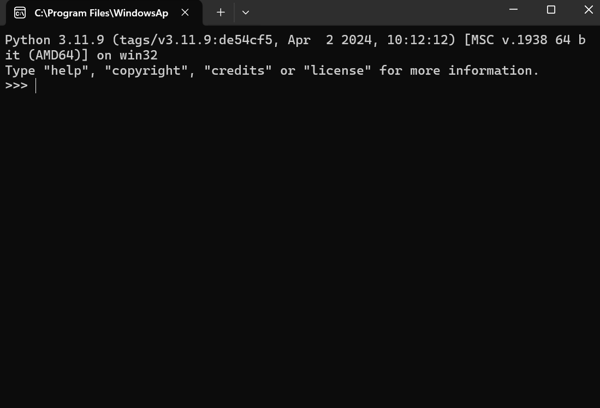
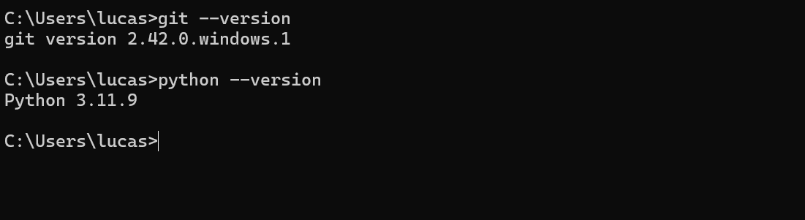
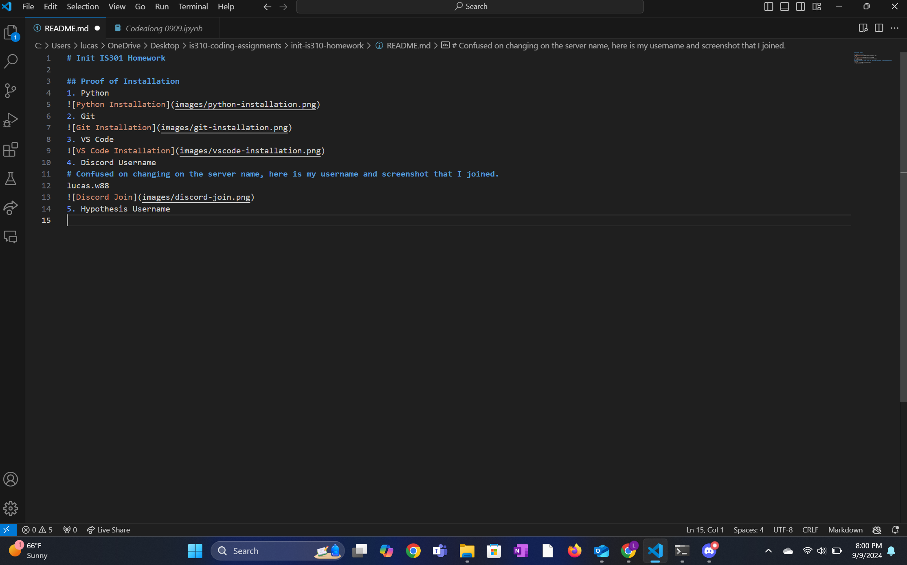
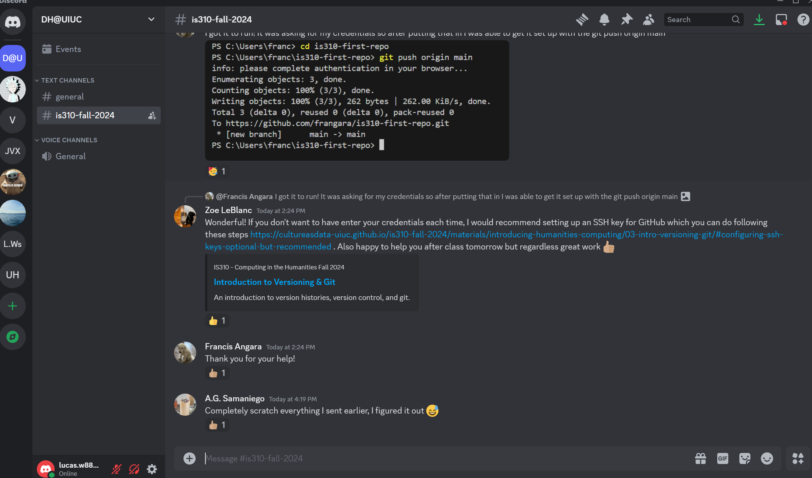

# Init IS301 Homework

## Proof of Installation
1. Python

2. Git

3. VS Code

4. Discord Username
# Confused on changing on the server name, here is my username and screenshot that I joined.
lucas.w88

5. Hypothesis Username
lwashor2